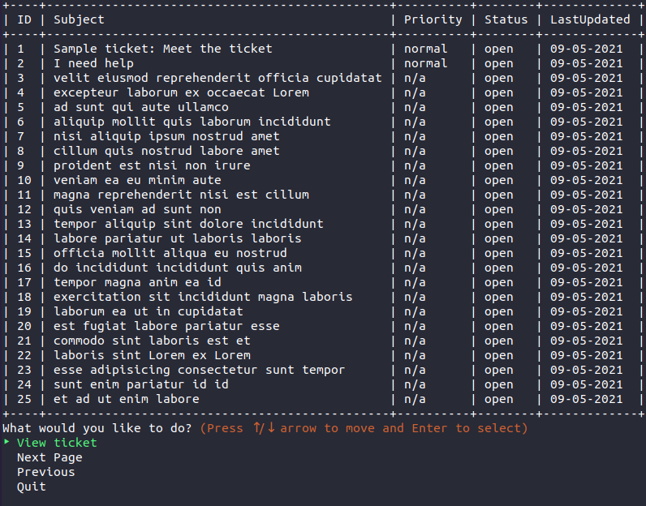
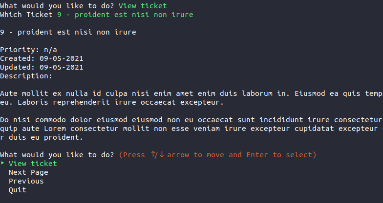

# Zendesk CLI Ticket Viewer

> A simple CLI ticket viewer built with Ruby and designed to connect to the Zendesk API.
> Built in response to the Zendesk teams Intern coding challenge.

## Table of Contents

- [General Info](#general-information)
- [Technologies Used](#technologies-used)
- [Features](#features)
- [Screenshots](#screenshots)
- [Setup](#setup)
- [Usage](#usage)
- [Automated Tests](#tests)
- [Project Status](#project-status)
- [Room for Improvement](#room-for-improvement)
- [Acknowledgements](#acknowledgements)
- [Contact](#contact)

## General Information

- This is a small project intended to showcase my skillset in response to a coding challenge brief assigned by Zendesk.
- It allows an Agent to connect to their unique Zendesk subdomain through the Zendesk API and return a paginated list of tickets. 
- This has been an excellent opportunity to learn about API's and automated unit testing.

## Technologies Used

- Ruby - version 2.7.2

### Ruby Gem Dependencies

- Rspec - version 3.1
  - Automated testing library
- Json - version 2.5
  - Library for parsing and creating Json files
- Tty-prompt - version 0.23.1
  - Helper library for terminal based user input 
- Tty-table - version 0.12.0
  - Helper library for tabulated output in the terminal
- Faraday - version 1.4
  - Api library for making HTTP requests

## Features

- Save and store user credentials
- Make get requests to the Zendesk Api for tickets
- View a tabulated list of tickets for a brief summary
- Page through the list of tickets if greater than 25
- View individual tickets in detail

## Screenshots





## Setup

This CLI tool was built and tested using Ruby version 2.7.2, mileage may vary on alternate ruby versions.

To run for the first time, cd into the projects root directory and run the following commands:

```sh
bundle install
ruby run.rb
```

## Usage

Subsequent launches will only require `ruby run.rb` to be executed from the root directory.

For testing purposes dummy credentials have been included in the  `credentials.Json` file in the `./data` directory, credentials can either be overridden here directly, or updated from within the application.

When first launching the application it will confirm whether you wish to connect to the saved subdomain, then once either new credentials have been entered or existing credentials are accepted an API call will be made to the `tickets` endpoint. Returning at most 25 tickets. From there a user can either select a ticket to view more information or continue to page through tickets in sets of 25.

## Automated Tests

Some automated unit testing has been included. Before running the tests, `bundle install` must have been run to pull down the required dependencies. For tests to work correctly `/data/credentials.json` must be present and populated. To this end, the file is included in the repository pre-populated with dummy data.

Once the above condition has been met, tests can be run with the following command from the root directory:

```sh
rspec -fd
```

## Project Status

Project is: _complete_. Whilst further features could be added, and current functionality extended this project has been submitted for review by Zendesk.

## Room for Improvement

- Encryption and Decryption of stored user credentials
- Local saving of tickets to allow viewing in the event API is unavailable
- Further breakdown of methods to allow more thorough unit testing
- Expansion of user and api classes to allow more integration with the API
- CRUD functionality

## Acknowledgements

- Many thanks to the team at Zendesk without whom I wouldn't have undertaken this challenge
- Thanks to the many great contributors of questions and answers in the zendesk-coding-challenge slack channel
- And of course many thanks to the authors of the great gems this project was built upon!

## Contact Me

Created by: [@RyanJWise](@RyanJWise) - ryan.jeffwise@gmail.com

Project Link: https://github.com/ryanjwise/zendesk-coding-challenge